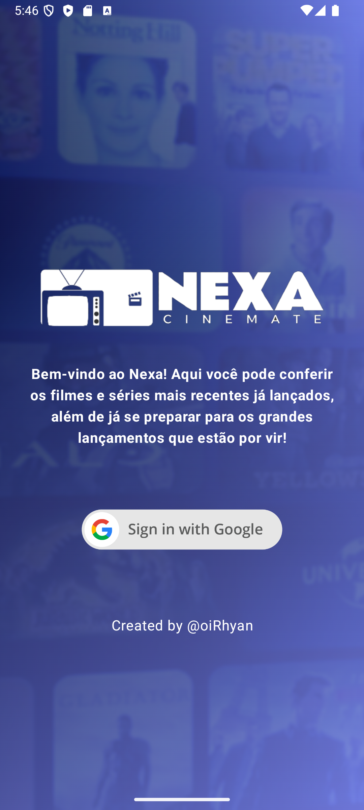
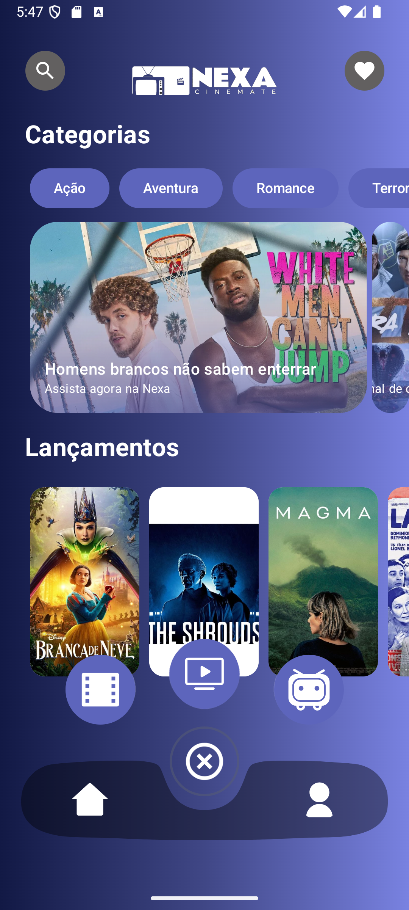
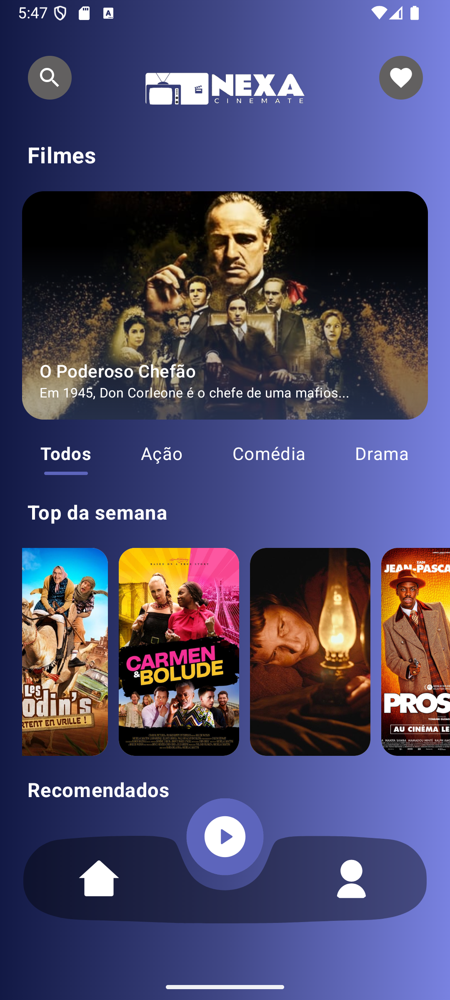
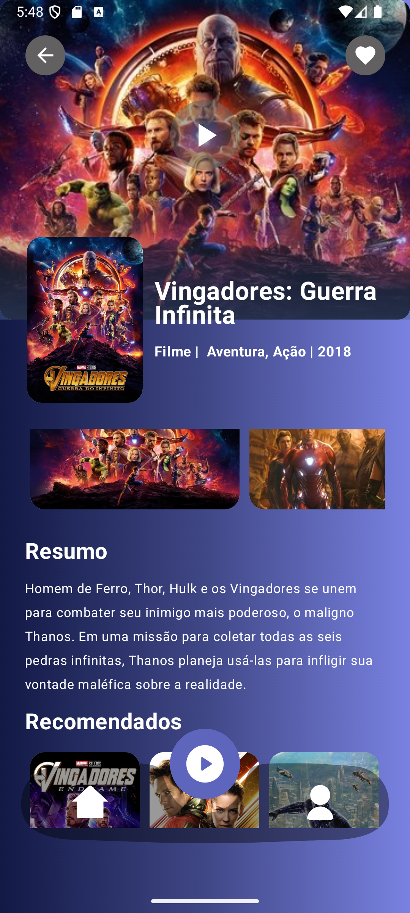

  

## Tecnologias Utilizadas

## Objetivo

Este projeto tem como objetivo criar um serviço de Streaming capaz de reproduzir filmes, séries e desenhos além de trazer as mídias mais recentes do mercado, de modo otimizado e em alta qualidade.

## Frameworks e Ferramentas

- Interface: JetpackCompose & Material Design 3
- Injeção de dependencias e Network: Koin, Ktor (HttpClient), FireBase (OAuth)
- Arquitetura e Design Patnners: MVVM (Model View ViewModel)
- Testes Unitários: MockK, Espresso, JUnit4

## Imagens

   
   
   
   

## Filmes, Séries e Animes (API Rest)

Para a requisição de mídias foi utilizado a API TMDB, onde a mesma foi requisitada utilizando a biblioteca Ktor, você pode conferir todos as requisições em seus respectivos repositórios,
por exemplo filmes serão requisitados pelo arquivo MovieRepository, onde o mesmo irá depender de um serviço Ktor para sua execução o qual está injetado como depêndencia utilizando o Koin.
Para utilizar a API de forma correta certifique de adicionar sua API_KEY no arquivo Utils.kt!

## Reprodução de Mídias

Para realizar a reprodução de todos os filmes e séries utilizamos uma API externa de reprodução + WebView. Recomendo utilizar a API visco muito utilizada para reprodução de mídias através da API TMDB.
Para que a reprodução tenha sucesso utilizamos os IDS únicos da mídia fornecidas pelo TMDB, dessa forma carregamos um embbed em WebView possibilitando que o usuário tenha uma fluídez melhor e mais responsiva em sua aplicação.

<h1 align="center">
   Developed by Rhyan Araujo Chaves @2024
</h1>

